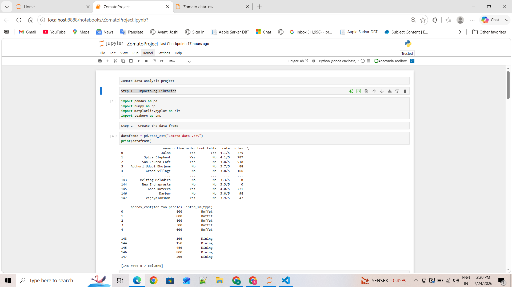
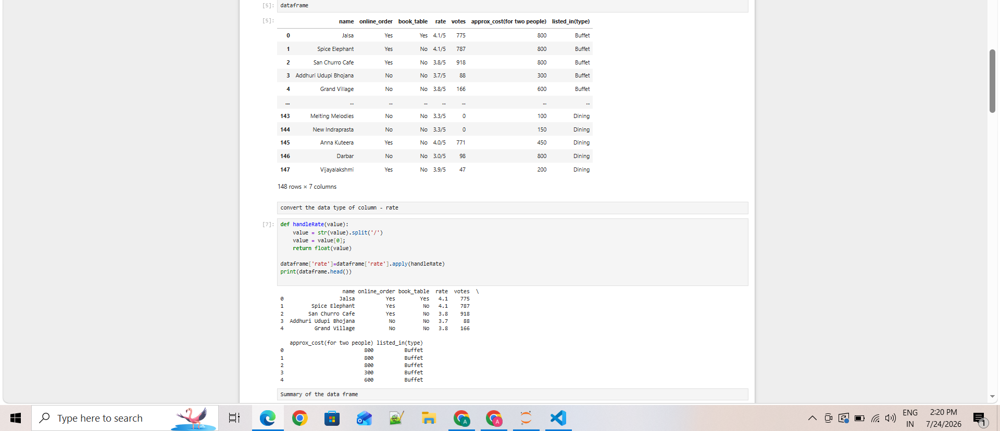
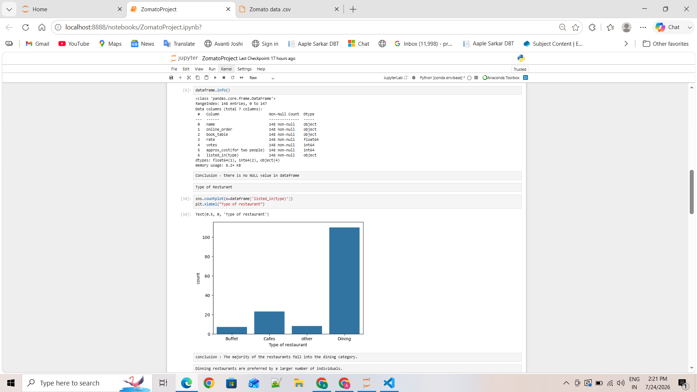
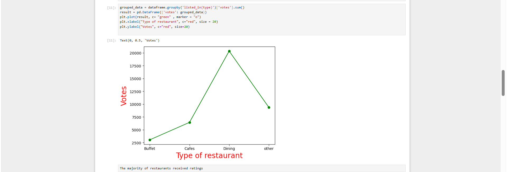
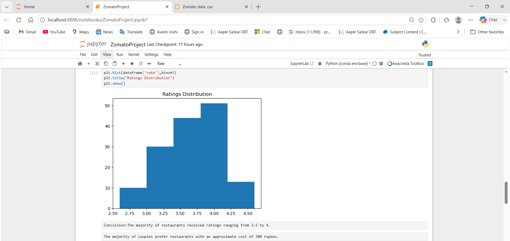
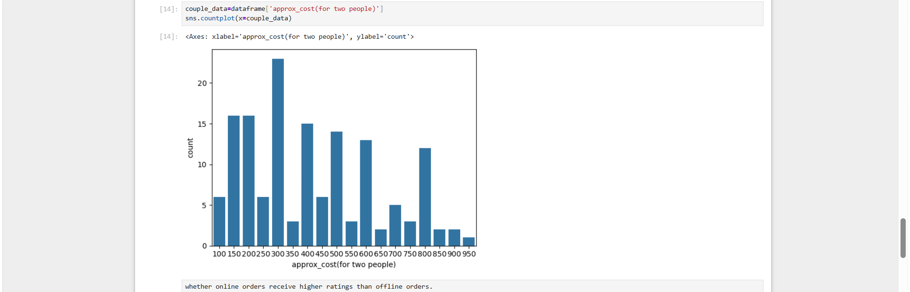
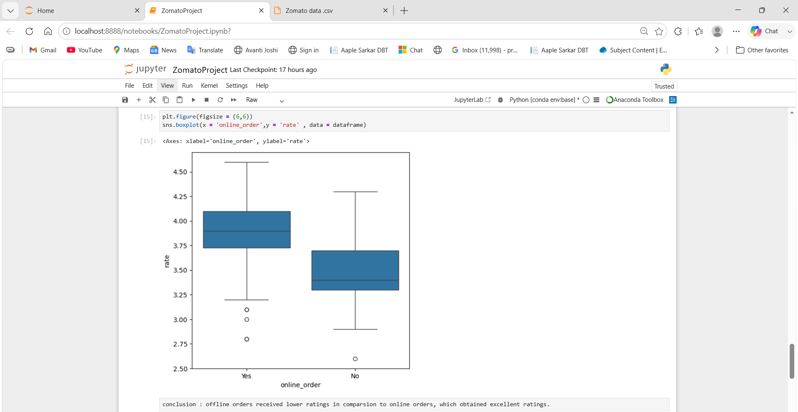
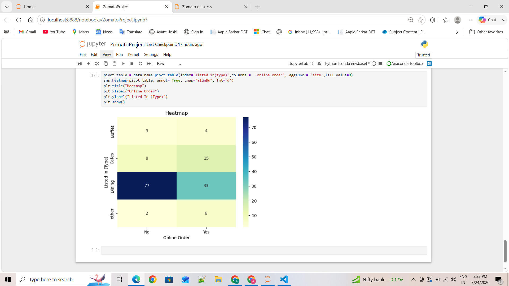

# 🍽️ Zomato Restaurant Data Analysis (EDA)

Exploratory Data Analysis on Zomato restaurant data using Python to uncover customer ordering patterns, rating trends, and business insights — built as a hands-on data analytics project.

________________________________________________________________________________________________________________________________________________


## 📌 Project Overview

Zomato has an average of **17.5 million monthly transacting customers**, with active restaurant partners growing **8.7% year-on-year** (208,000 → 226,000). As a data professional working with a sample of Zomato's restaurant dataset, this project performs EDA and visualization to answer key business questions that could help Zomato make data-driven decisions around customer offers, partner engagement, and platform strategy.

________________________________________________________________________________________________________________________________________________


## 🎯 Business Questions Answered

1. What type of restaurant do the majority of customers order from?
2. How many votes has each type of restaurant received from customers?
3. What ratings do the majority of restaurants receive?
4. What is the average spending per order for couples ordering online?
5. Which mode (online or offline) receives the maximum rating?
6. Which restaurant type receives more offline orders, so Zomato can target them with offers?

________________________________________________________________________________________________________________________________________________

## 🛠️ Tools & Libraries

- **Python 3**
- **Pandas** – data loading, cleaning, and manipulation
- **NumPy** – numerical operations
- **Matplotlib** – data visualization
- **Seaborn** – statistical visualizations
- **Jupyter Notebook** – interactive analysis environment

________________________________________________________________________________________________________________________________________________


## 📁 Project Structure

```
zomato-eda-project/
├── README.md
├── data/
│   └── zomato_data.csv
├── notebooks/
│   └── ZomatoProject.ipynb
├── images/
│   ├── 01_import_load_data.png
│   ├── 02_data_cleaning_rate.png
│   ├── 03_dataframe_info_type_countplot.png
│   ├── 04_votes_by_restaurant_type.png
│   ├── 05_ratings_distribution.png
│   ├── 06_couple_cost_distribution.png
│   ├── 07_online_vs_offline_ratings.png
│   └── 08_heatmap_type_vs_online.png
├── requirements.txt
└── .gitignore
```

________________________________________________________________________________________________________________________________________________


## 🔍 Analysis Workflow

### 1. Data Import & Cleaning
Loaded the dataset (148 rows × 7 columns) and cleaned the `rate` column by stripping the `/5` suffix and converting it to a float for numerical analysis. Verified there were no null values across all columns.





### 2. Restaurant Type Distribution
```python
sns.countplot(x=dataframe['listed_in(type)'])
```
**Insight:** The majority of restaurants fall into the **Dining** category (110+ out of 148), followed by Cafes. Dining restaurants are preferred by a larger number of individuals.



### 3. Votes by Restaurant Type
```python
grouped_data = dataframe.groupby('listed_in(type)')['votes'].sum()
```
**Insight:** Dining restaurants received the highest total votes (~20,000+), significantly more than Cafes, Buffet, or Other categories — confirming Dining as both the most common and most engaged-with restaurant type.



### 4. Ratings Distribution
```python
plt.hist(dataframe['rate'], bins=5)
```
**Insight:** The majority of restaurants received ratings ranging from **3.5 to 4.0**, indicating generally positive customer experiences across the platform.



### 5. Cost Preference for Couples
```python
sns.countplot(x=dataframe['approx_cost(for two people)'])
```
**Insight:** The majority of couples prefer restaurants with an approximate cost of **₹300** for two people, suggesting affordability is a key driver of order volume.



### 6. Online vs Offline Order Ratings
```python
sns.boxplot(x='online_order', y='rate', data=dataframe)
```
**Insight:** Restaurants that accept **online orders received noticeably higher ratings** compared to those that don't, suggesting online ordering correlates with better customer satisfaction.



### 7. Restaurant Type vs Online Ordering (Heatmap)
```python
pivot_table = dataframe.pivot_table(index='listed_in(type)', columns='online_order', aggfunc='size', fill_value=0)
sns.heatmap(pivot_table, annot=True, cmap="YlGnBu", fmt='d')
```
**Insight:** **Dining restaurants primarily receive offline orders** (77 offline vs. 33 online), while **Cafes lean more toward online orders** (15 online vs. 8 offline). This suggests customers prefer walk-in/dine-in experiences at full-service restaurants but favor online ordering convenience at cafes — actionable for Zomato to design targeted offers for dining restaurants to boost online adoption.



________________________________________________________________________________________________________________________________________________


## 📊 Key Insights Summary

| Question | Insight |
|---|---|
| Most ordered restaurant type | Dining |
| Restaurant type with most votes | Dining (~20,000+ votes) |
| Most common rating range | 3.5 – 4.0 |
| Average couple spend | ~₹300 |
| Higher-rated ordering mode | Online |
| Restaurant type with most offline orders | Dining |

________________________________________________________________________________________________________________________________________________


## 🚀 How to Run This Project

1. Clone the repository:
   ```bash
   git clone https://github.com/yourusername/zomato-DA-project.git
   cd zomato-DA-project
   ```

2. Install dependencies:
   ```bash
   pip install -r requirements.txt
   ```

3. Launch Jupyter Notebook:
   ```bash
   jupyter notebook notebooks/ZomatoProject.ipynb
   ```

4. Run all cells to reproduce the analysis and visualizations.

---

## 📈 Future Enhancements

- Build an interactive Power BI / Tableau dashboard on top of this dataset
- Add a machine learning model to predict restaurant ratings based on cost, votes, and order type
- Expand the dataset with more restaurants for deeper statistical significance

---


⭐ If you found this project useful, consider giving it a star!
